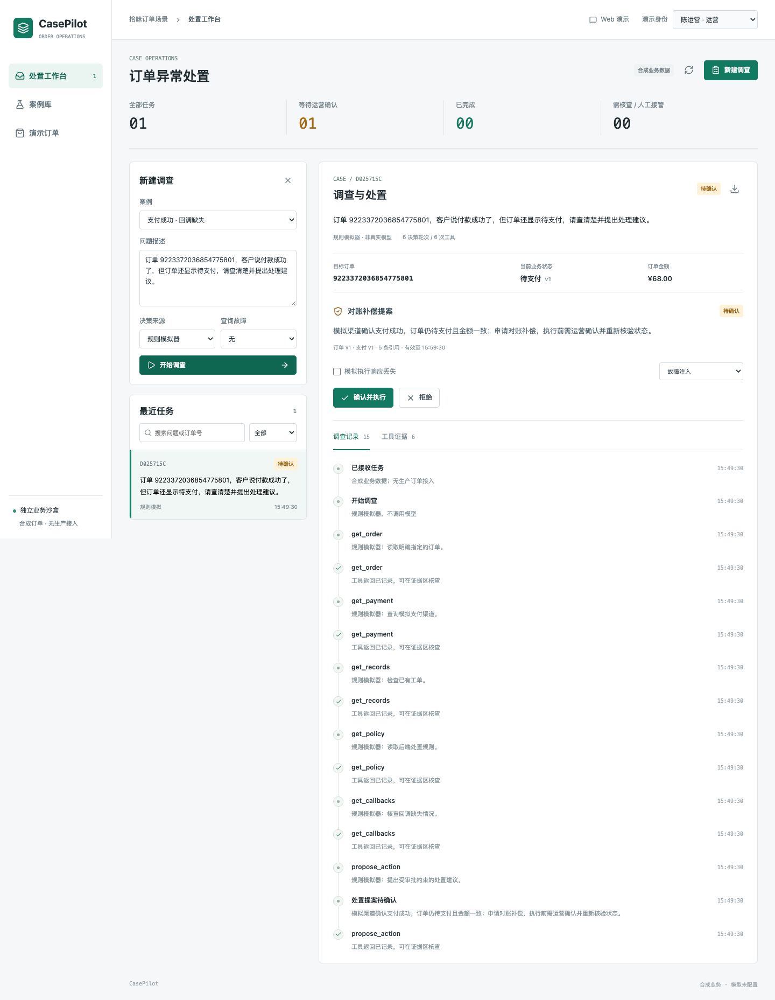

# CasePilot

面向订单支付异常的垂直 Agent：把客户描述转成可核查的调查过程，依据工具反馈选择后续查询，提出处置建议，经运营确认后执行并回查结果。

**个人项目，借鉴拾味篮子业务场景；订单、支付渠道和工单均为合成沙盒，不代表公司上线或真实支付接入。** 默认运行规则模拟器，界面明确标识来源；真实模式使用 DeepSeek 原生 Tool Calling，不自动降级。



## 快速运行

需要 Node.js >=22.13，推荐 Node.js 24；Node.js 16 不支持本项目使用的 `node:sqlite`。

```bash
nvm use
npm ci
cp .env.example .env
npm run dev
```

打开 http://localhost:5188。不配 Key 也可以演示规则基线；它不等于模型 Agent。

真实模型：在 `.env` 设置 `DEEPSEEK_API_KEY` 和 `AGENT_MODE=deepseek`，重启服务。默认模型 `deepseek-flash`，单任务最多 12 次请求、24 次工具调用；错误不会伪装为模拟成功。不要提交 `.env`。

## 演示主线

1. 选择“支付成功 · 回调缺失”，以客服身份开始调查，核查工具证据；审批前订单不变。
2. 切换运营身份确认提案，对账后回查订单状态。
3. 新订单提案确认前注入“订单被并发关闭”，旧提案失效；重新调查后转为异常工单建议。
4. 勾选“模拟执行响应丢失”再确认，核对原执行记录而不是重放；服务重启也会核对未知结果。

沙盒写入会持久保存，重复调查已支付订单会得到不同结果。这是状态变化，不是演示失败。需要独立演示数据时用新的 `DATA_DIR`，不要删除其他运行中的目录。

## 验证

```bash
npm test
npm run build
npm run eval
npx playwright install chromium
npm run test:ui
# 需要自己的模型配置，会产生费用；独立限制最多10次请求
npm run eval:model
```

基线、模型、界面报告和截图保存到 `artifacts/`，不自动提交；[本次验证记录](docs/VALIDATION.md)区分规则、真实模型和未验证范围。

## 钉钉与部署

钉钉使用企业内部测试机器人的 Stream 通道，无需公开接收回调。填写 `.env.example` 中应用凭证、组织 ID、员工身份映射，设置 `DINGTALK_ENABLED=true`。员工发送问题后可以用“补充 / 确认 / 拒绝 / 核对”文字命令继续任务。详见[钉钉配置](docs/ARCHITECTURE.md#钉钉入口)。**适配器已有离线验证，尚未完成真实测试应用联调；首版不是交互卡片。**

部署到可常驻的 Node.js 服务，挂载持久数据目录：`npm ci && npm run build && npm start`。非本机监听必须设置至少 24 位 `WEB_ACCESS_TOKEN`，并使用 HTTPS 反向代理。身份切换只是演示机制，不能接入真实业务数据。SQLite 文件、进程锁与 Stream 长连接不适合直接当作 Vercel Serverless 部署。

技术栈：TypeScript、Vue 3、Express、Node.js SQLite、Zod、DeepSeek Tool Calling、钉钉 Stream。

[架构与边界](docs/ARCHITECTURE.md) · [面试与演示](docs/INTERVIEW.md)
